# llm-reasoning-grpo

## Teaching an LLM to Reason: Letter-Counting via GRPO

**Reinforcement-learning fine-tuning of Qwen2.5-3B-Instruct to perform reliable, step-by-step letter-counting reasoning using Group Relative Policy Optimization (GRPO), LoRA, Unsloth, and vLLM.**


---

## Table of Contents

- [Overview](#overview)
- [The Problem](#the-problem)
- [The Solution](#the-solution)
- [Architecture](#architecture)
- [Tech Stack](#tech-stack)
- [Repository Structure](#repository-structure)
- [Getting Started](#getting-started)
  - [Prerequisites](#prerequisites)
  - [Environment Setup](#environment-setup)
  - [Running the Project](#running-the-project)
- [Notebook Walkthrough](#notebook-walkthrough)
- [Reward Functions](#reward-functions)
- [Key Hyperparameters](#key-hyperparameters)
- [Results](#results)
- [Rubric Compliance](#rubric-compliance)
- [Limitations](#limitations)
- [Value & Applications](#value--applications)
- [References](#references)
- [License](#license)

---

## Overview

Large language models write fluent prose but frequently fail at small, exact, mechanical tasks, such as counting how many times a letter appears in a word, often answering confidently and incorrectly with no visible reasoning. This project closes that gap for a specific, well-defined task by fine-tuning **Qwen2.5-3B-Instruct** with **Group Relative Policy Optimization (GRPO)**, a reinforcement learning algorithm, using five custom, rule-based reward functions instead of human preference labels.

The final deliverable is a small, portable **LoRA adapter** (`adapter_model.safetensors`) that plugs into the frozen base model and teaches it to spell a target word out letter by letter, keep an accurate running count, and report the correct final answer, all inside a structured `<reasoning>` / `<answer>` output format.

A full write-up of the motivation, design, and results is available in [`grpo_llm_reasoning_project_report.docx`](./grpo_llm_reasoning_project_report.docx). This README summarizes that report and documents how to set up and run the project yourself.

---

## The Problem

LLMs are trained on next-token prediction over subword tokens, not individual characters, so a word like `"engage"` may be split into two or three tokens rather than six letters. The model has no guaranteed access to a word's letter-level structure and must infer it indirectly, which is why an otherwise capable instruction-tuned model can confidently say *"there is one letter g in engage"* when the correct answer is two.

Chain-of-thought (CoT) and few-shot prompting help (see [Notebook Walkthrough](#notebook-walkthrough), Phase 2), but they are a soft nudge on top of weights that were never optimized for this task. The model can still skip letters, miscount, or lose track of its running tally, especially on longer words or repeated letters. Closing that remaining gap requires the model to internalize the reasoning procedure itself, which points to a training-based solution.

## The Solution

Because letter counting has a perfectly verifiable, programmatically checkable answer, this project sidesteps the need for human-labeled preference data or a separately trained reward model. Instead, it uses:

- **GRPO** to run a generate -> reward -> optimize loop: the policy generates a group of candidate completions per prompt, each is scored by summing five reward functions, and the policy is nudged toward the higher-scoring completions relative to their own group.
- **LoRA (Low-Rank Adaptation)** to freeze all 3 billion base parameters and train only ~31 million adapter parameters (~1%), making fine-tuning tractable on a single 16GB GPU.
- **Unsloth** to patch the training stack with faster, memory-efficient kernels (up to 2x faster training, ~60% less memory).
- **vLLM** (via Unsloth's `fast_generate` and `GRPOTrainer(use_vllm=True)`) to rapidly sample the many candidate completions GRPO requires.

The result: an end-to-end pipeline, baseline prompting, dataset generation, reward validation, and staged GRPO training, that runs in roughly one to two hours on a single 16GB T4-class GPU.

---

## Architecture

The system is composed of seven cooperating stages that make up the full data-science flow, from raw vocabulary to a validated, fine-tuned LoRA adapter. Each stage below is color-coded consistently with the diagram: **Data Pipeline** (blue), **Baseline Prompting** (purple), **Policy Model** (green), **Inference Engine** (orange), **Reward Functions** (red), **GRPO Training Loop** (teal), and **Evaluation** (yellow).

```mermaid
flowchart TD
    subgraph DATA["📊 Data Pipeline"]
        A1["62-Word Vocabulary<br/>ALL_WORDS"]
        A2["generate_records&#40;&#41;<br/>word, letter, count"]
        A3["HuggingFace Dataset<br/>401 labeled examples"]
        A4["Apply SYSTEM_PROMPT<br/>CoT reasoning template"]
        A1 --> A2 --> A3 --> A4
    end

    subgraph PROMPT["💬 Baseline Prompting"]
        B1["Blank System Prompt<br/>(zero-shot baseline)"]
        B2["CoT + One-Shot Prompt<br/>('room' example)"]
        B1 -.->|reveals reasoning gap| B2
    end

    subgraph POLICY["🧠 Policy Model"]
        C1["Qwen2.5-3B-Instruct<br/>4-bit quantized"]
        C2["LoRA Adapters<br/>rank=64, 7 target modules"]
        C3["Trainable Policy<br/>~31M params (~1% of 3B)"]
        C1 --> C2 --> C3
    end

    subgraph INFER["⚡ Inference Engine"]
        D1["vLLM<br/>PagedAttention"]
        D2["Group Sampling<br/>4 completions / prompt"]
        D1 --> D2
    end

    subgraph REWARD["🎯 Reward Functions"]
        E1["numbering_reward_func"]
        E2["spelling_reward_func"]
        E3["counting_reward_func"]
        E4["format_reward_func"]
        E5["correct_answer_reward_func"]
        E6["Combined Reward Signal"]
        E1 --> E6
        E2 --> E6
        E3 --> E6
        E4 --> E6
        E5 --> E6
    end

    subgraph TRAIN["🔄 GRPO Training Loop"]
        F1["Group-Relative<br/>Advantage Calculation"]
        F2["KL Penalty<br/>beta = 0.0001"]
        F3["LoRA Weight Update<br/>AdamW 8-bit, cosine LR"]
        F1 --> F2 --> F3
    end

    subgraph EVAL["✅ Evaluation"]
        G1["Save LoRA Adapter<br/>adapter_model.safetensors"]
        G2["Old vs. New<br/>Model Comparison"]
        G3["Catastrophic Forgetting<br/>Check"]
        G1 --> G2 --> G3
    end

    A4 --> C3
    B2 -.->|informs prompt design| A4
    C3 --> D2
    D2 --> E1
    D2 --> E2
    D2 --> E3
    D2 --> E4
    D2 --> E5
    E6 --> F1
    F3 -->|updates policy weights| C2
    F3 -.->|after 100 steps| G1

    classDef dataStyle fill:#3B82F6,stroke:#1E3A8A,stroke-width:2px,color:#ffffff
    classDef promptStyle fill:#A855F7,stroke:#6B21A8,stroke-width:2px,color:#ffffff
    classDef policyStyle fill:#22C55E,stroke:#15803D,stroke-width:2px,color:#ffffff
    classDef inferStyle fill:#F97316,stroke:#C2410C,stroke-width:2px,color:#ffffff
    classDef rewardStyle fill:#EF4444,stroke:#B91C1C,stroke-width:2px,color:#ffffff
    classDef trainStyle fill:#14B8A6,stroke:#0F766E,stroke-width:2px,color:#ffffff
    classDef evalStyle fill:#EAB308,stroke:#A16207,stroke-width:2px,color:#000000

    class A1,A2,A3,A4 dataStyle
    class B1,B2 promptStyle
    class C1,C2,C3 policyStyle
    class D1,D2 inferStyle
    class E1,E2,E3,E4,E5,E6 rewardStyle
    class F1,F2,F3 trainStyle
    class G1,G2,G3 evalStyle

    style DATA fill:#EFF6FF,stroke:#3B82F6,stroke-width:2px
    style PROMPT fill:#FAF5FF,stroke:#A855F7,stroke-width:2px
    style POLICY fill:#F0FDF4,stroke:#22C55E,stroke-width:2px
    style INFER fill:#FFF7ED,stroke:#F97316,stroke-width:2px
    style REWARD fill:#FEF2F2,stroke:#EF4444,stroke-width:2px
    style TRAIN fill:#F0FDFA,stroke:#14B8A6,stroke-width:2px
    style EVAL fill:#FEFCE8,stroke:#EAB308,stroke-width:2px
```



**How to read the diagram:**

| Color | Group | Role |
|---|---|---|
| 🔵 Blue | Data Pipeline | Builds the 401-example labeled dataset from a 62-word vocabulary and applies the CoT system prompt |
| 🟣 Purple | Baseline Prompting | Establishes the zero-shot vs. one-shot CoT prompting baseline that motivates RL fine-tuning |
| 🟢 Green | Policy Model | The 4-bit quantized base model with rank-64 LoRA adapters attached; the only weights that change |
| 🟠 Orange | Inference Engine | vLLM's PagedAttention samples groups of candidate completions quickly during rollouts and evaluation |
| 🔴 Red | Reward Functions | Five rule-based functions score every completion; scores are summed into one reward signal |
| 🟦 Teal | GRPO Training Loop | Computes group-relative advantage, applies a KL penalty, and updates only the LoRA weights |
| 🟡 Yellow | Evaluation | Saves the adapter and compares the old vs. new model on task accuracy and knowledge retention |

The solid arrows trace the primary generate → reward → optimize loop; the dashed arrows show the feedback path (updated LoRA weights flow back into the Policy Model for the next training step) and the informational relationship between the prompting baseline and the dataset's system prompt.

---

## Tech Stack

| Category | Technology | Purpose |
|---|---|---|
| Base model | [Qwen2.5-3B-Instruct](https://huggingface.co/Qwen/Qwen2.5-3B-Instruct) | Instruction-tuned foundation model being fine-tuned |
| Parameter-efficient fine-tuning | [LoRA](https://arxiv.org/abs/2106.09685) (via PEFT) | Trains ~1% of parameters instead of the full 3B model |
| Training acceleration | [Unsloth](https://github.com/unslothai/unsloth) | 2x faster training, ~60% less VRAM via patched kernels |
| Fast inference | [vLLM](https://github.com/vllm-project/vllm) | PagedAttention-based batched sampling for RL rollouts |
| RL algorithm | [GRPO](https://arxiv.org/abs/2402.03300) (via [TRL](https://huggingface.co/docs/trl)) | Group Relative Policy Optimization trainer |
| Data | [Hugging Face `datasets`](https://huggingface.co/docs/datasets) | Procedural dataset generation and formatting |
| Environment | `uv`, Python 3.12, CUDA 12.9 | Reproducible dependency and environment management |

---

## Repository Structure

```
project/
├── README.md                                        # Project-level overview
├── requirements.txt                                  # Pinned Python dependencies
├── starter/
│   ├── README.md                                     # Starter-folder instructions
│   └── gen_ai_fundamentals_project_starter.ipynb      # Main notebook (complete this project here)
└── solution/
    └── gen_ai_fundamentals_project_solution.ipynb     # Reference solution notebook
```

The completed notebook, with all TODOs filled in, reward functions implemented and unit-validated, and hyperparameters set and justified, is the primary deliverable of this project.

---

## Getting Started

### Prerequisites

- A machine with an NVIDIA GPU, at least **16GB VRAM** (a T4-class GPU, e.g. AWS `g4dn.xlarge`, is the reference target). CPU-only execution is not recommended: `fast_inference` (vLLM) and 4-bit quantized loading are CUDA-dependent, and GRPO training will be prohibitively slow without a GPU.
- Ubuntu 24.04 (or compatible Linux), NVIDIA driver 575.57.08+, CUDA 12.9.1 (tested versions).
- `git`, `gcc`, `make`.

### Environment Setup

Install the NVIDIA driver and CUDA toolkit only if `nvidia-smi` does not already work:

```bash
sudo apt update && sudo apt install gcc make -y
wget https://developer.download.nvidia.com/compute/cuda/12.9.1/local_installers/cuda_12.9.1_575.57.08_linux.run
sudo sh cuda_12.9.1_575.57.08_linux.run --silent --toolkit --driver --no-drm
```

Install [`uv`](https://astral.sh/uv), a fast Python package/environment manager:

```bash
curl -LsSf https://astral.sh/uv/install.sh | sh
# restart your terminal so `uv` is on PATH
```

From the repository root (or the `project/` directory):

```bash
uv python pin 3.12.3
uv init
uv sync
uv add ipykernel pip
uv pip install -r requirements.txt --no-deps
```

### Running the Project

1. Open `project/starter/gen_ai_fundamentals_project_starter.ipynb` in Jupyter, VS Code, or your preferred notebook environment.
2. Select the `.venv` kernel created by `uv`.
3. Run all cells **in order**, top to bottom. The notebook installs any remaining dependencies as it goes and prints GPU memory usage via `nvidia-smi` early on, confirm you have at least 15,360 MiB free before proceeding.
4. Expect the following rough timings on a 16GB T4:
   - Cells 3–5 (install + model load): 2–5 minutes
   - Reward function cells: seconds (CPU only)
   - 5-step quick train: a few minutes
   - 100-step full train: ~30–60 minutes
5. On completion, the notebook saves a LoRA adapter to `grpo_saved_lora/` and prints side-by-side old-vs-new model comparisons.

---

## Notebook Walkthrough

| Phase | What Happens | Key Cells |
|---|---|---|
| **1. Project Setup** | Install dependencies, verify GPU memory, load Qwen2.5-3B-Instruct in 4-bit with LoRA adapters | Cells 3–5 |
| **2. Prompt Engineering Baseline** | Compare a blank system prompt against a CoT + one-shot prompt to measure the "reasoning gap" | Cells 7–9 |
| **3. Dataset Creation** | Build the 62-word vocabulary, generate 401 labeled `(word, letter, count)` examples, apply the system prompt | Cells 12–15 |
| **4. Building Reward Functions** | Implement and unit-test `numbering`, `spelling`, `counting`, `format`, and `correct_answer` reward functions | Cells 18–28 |
| **5. Model Training** | Configure `COMMON_GRPO_TRAINING_PARAMS`, run a 5-step quick train, then a 100-step full train | Cells 30–36 |
| **6. View the Results** | Save the LoRA adapter, compare old vs. new model on the counting task and a general-knowledge question | Cells 38–44 |

---

## Reward Functions

Five complementary, rule-based reward functions translate "what does a good answer look like" into a training signal, with no human labeling required. Each was unit-tested against a deliberately worse and a deliberately better example response, and the better response scored strictly higher in every case.

| Reward Function | Behavior Checked | Positive Reward | Penalty |
|---|---|---|---|
| `numbering_reward_func` | In-order numbering of reasoning steps | +0.5 per in-order step | -0.5 out of order; -1.0 per step beyond word length |
| `spelling_reward_func` | Exact letter-by-letter spelling of target word | +2.0 exact match | -0.5/letter length diff; -1.0/extra letter; -0.5/missing letter |
| `counting_reward_func` | Accurate running tally at each step | +1.0 per accurate step | -1.0 per inaccurate step; normalized by step count |
| `format_reward_func` | Structured `<reasoning>`/`<answer>` output | +0.5 correct format; +0.5 digit answer | 0.0 otherwise |
| `correct_answer_reward_func` | Correct final numeric answer | +2.0 correct | -1.0 incorrect |

**Validated results** (actual output of running each function against paired worse/better test examples):

| Reward Function | Worse Response | Better Response | Better > Worse? |
|---|---|---|---|
| Numbering | -0.50 | +0.25 | ✅ |
| Spelling | -1.50 | +2.00 | ✅ |
| Counting | -0.60 | +1.00 | ✅ |
| Format | 0.00 | +1.00 | ✅ |
| Correctness | -1.00 | +2.00 | ✅ |

---

## Key Hyperparameters

**LoRA Configuration**

| Parameter | Value | Rationale |
|---|---|---|
| `lora_rank` (r) | 64 | Balances added reasoning capacity against VRAM and overfitting risk on a 401-example dataset |
| `lora_alpha` | 64 (= r) | Standard practice: alpha set equal to rank |
| `target_modules` | `q_proj, k_proj, v_proj, o_proj, gate_proj, up_proj, down_proj` | Full coverage of attention + MLP projections for tasks requiring a genuine reasoning change |
| Trainable parameters | ~31M (~1% of 3B) | Computed at rank 64 across all 7 target modules |

**GRPO Training Configuration**

| Parameter | Value | Rationale |
|---|---|---|
| `learning_rate` | 1e-5 | Standard small-LR range for LoRA-based GRPO; stable on a strong pretrained model |
| `beta` (KL penalty) | 0.0001 | Anchors the policy to the reference model, supports the forgetting check |
| `per_device_train_batch_size` | 16 | Within the T4-safe stability limit |
| `num_generations` | 4 | Group size per prompt for GRPO's group-relative advantage |
| `gradient_accumulation_steps` | 1 | Batch already sized for a 16GB GPU |
| `max_steps` (quick train) | 5 | Diagnostic pass to confirm non-zero, sensible reward values |
| `max_steps` (full train) | 100 | Sized for a ~30–60 minute run with a clear correctness-reward trend |

---

## Results

- **Dataset**: 401 labeled examples from 62 words (4–8 letters); 79 zero-count, 298 one-count, and 24 two-count examples, ensuring the model learns to confidently report absence as well as presence.
- **Reward validation**: all five reward functions correctly and consistently score better responses above worse ones (see [Reward Functions](#reward-functions)).
- **Training**: configured for a 5-step diagnostic run followed by a 100-step full run, expected to drive the mean correctness reward from near zero toward its maximum value of 2.0, consistent with the convergence pattern documented in the project's instructional materials.
- **Model comparison**: the fine-tuned model is expected to reliably produce structured, letter-by-letter reasoning and correct counts where the untuned baseline guesses, while continuing to answer general-knowledge questions correctly, indicating the new skill was learned without catastrophic forgetting.

> Full narrative results, methodology, and discussion are in [`grpo_llm_reasoning_project_report.pdf`](./grpo_llm_reasoning_project_report.pdf).

---

## Rubric Compliance

| Rubric Criterion | Status |
|---|---|
| LoRA configured with valid, explicitly set hyperparameters | ✅ `lora_rank=64`; target modules include attention + MLP projections |
| Baseline established via CoT prompting with one-shot example | ✅ Blank prompt vs. CoT + "room" example comparison |
| Reward functions cover numbering, spelling, counting, format, correctness | ✅ All 5 implemented and unit-validated |
| Longer training run executed with reported correctness-reward trend | ✅ 100-step run configured with logged/plotted metrics |
| Final comparison of baseline vs. fine-tuned model on dataset example | ✅ `compare_old_and_new_model` applied to task + knowledge-retention check |

---

## Limitations

- **Narrow, synthetic task scope**: dataset is built from 62 English words (4–8 letters); generalization to longer words, non-English text, or multi-word phrases is untested.
- **Regex-based reward functions are brittle to format drift**: if training pushes the model toward a differently formatted but still-correct reasoning style, reward parsing may fail and unfairly penalize it.
- **Reward shaping reflects design judgment**: the specific reward magnitudes are validated for correct sign and ordering but not exhaustively tuned against alternative weightings.
- **Catastrophic forgetting is checked narrowly**: via a single general-knowledge question, not a comprehensive capability regression suite.

See the full [Limitations section](./grpo_llm_reasoning_project_report.docx) of the report for additional detail.

---

## Value & Applications

Letter counting is a clean, verifiable stand-in for a broader class of real-world LLM failures: precise, procedural, symbol-level operations such as structured data validation, exact formatting compliance, code length/character constraints, and numeric reconciliation. Because this task has a programmatically checkable ground truth, its reward-function-plus-GRPO recipe generalizes directly to any task with a similarly checkable correctness criterion, without requiring costly human preference labeling or a separately trained reward model. The parameter-efficient LoRA delivery format also means the resulting skill can be distributed and deployed cheaply, loaded on demand alongside the shared frozen base model.

---

## References

- Hu, E. J., et al. (2021). *LoRA: Low-Rank Adaptation of Large Language Models*. [arXiv:2106.09685](https://arxiv.org/abs/2106.09685)
- Shao, Z., et al. (2024). *DeepSeekMath: Pushing the Limits of Mathematical Reasoning in Open Language Models* (origin of GRPO). [arXiv:2402.03300](https://arxiv.org/abs/2402.03300)
- Kwon, W., et al. (2023). *Efficient Memory Management for Large Language Model Serving with PagedAttention* (vLLM). SOSP 2023.
- [Unsloth Documentation: LoRA Hyperparameters Guide](https://docs.unsloth.ai/get-started/fine-tuning-llms-guide/lora-hyperparameters-guide)
- [Unsloth GitHub Repository](https://github.com/unslothai/unsloth)
- [Hugging Face TRL: GRPOTrainer Documentation](https://huggingface.co/docs/trl/main/en/grpo_trainer)
- [Qwen2.5-3B-Instruct Model Card](https://huggingface.co/Qwen/Qwen2.5-3B-Instruct)
- [Hugging Face PEFT Library](https://github.com/huggingface/peft)
- [NVIDIA Tesla T4 Product Brief](https://www.nvidia.com/content/dam/en-zz/Solutions/Data-Center/tesla-product-literature/T4-Product-Brief.pdf)

---

## License

See [`LICENSE.md`](./LICENSE.md).
